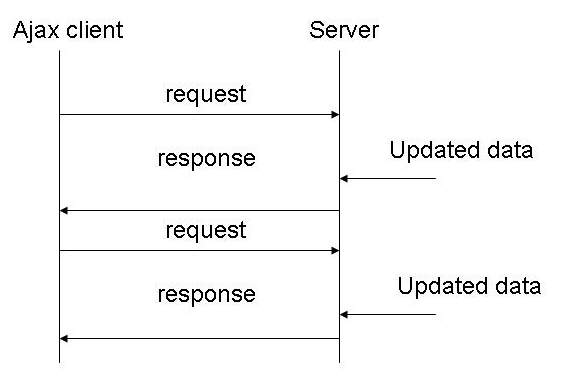

# long-polling-sample
---

To overcome this deficiency, Web app developers can implement a technique
called HTTP long polling, where the client polls the server requesting new information.
The server holds the request open until new data is available. Once available,
the server responds and sends the new information. When the client receives
the new information, it immediately sends another request, and the operation is repeated.
This effectively emulates a server push feature. A simple diagram below:

## Instructions to run

> `npm install`

> `npm start` OR `node long-poll-server.js`

> Open multiple browser instances on `http://localhost:3000`